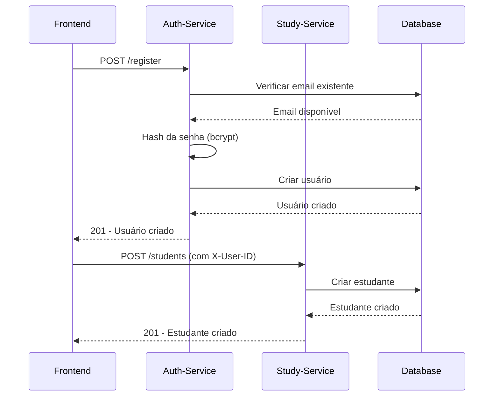
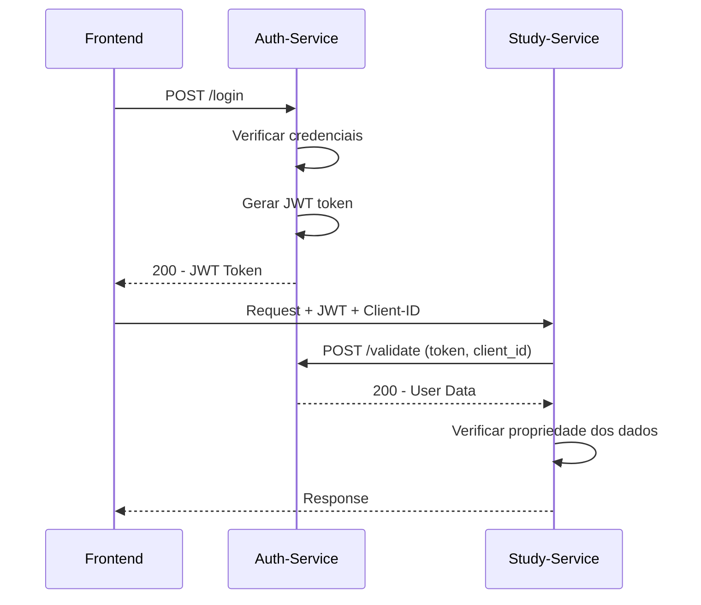
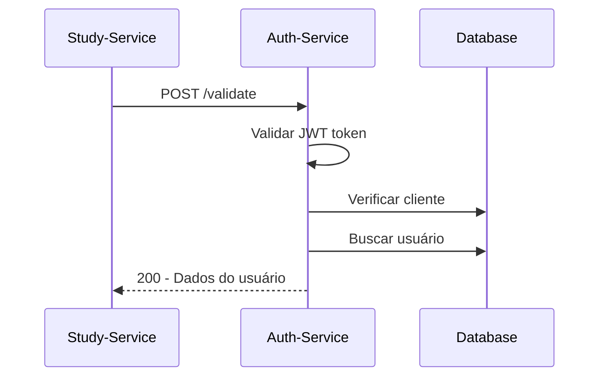
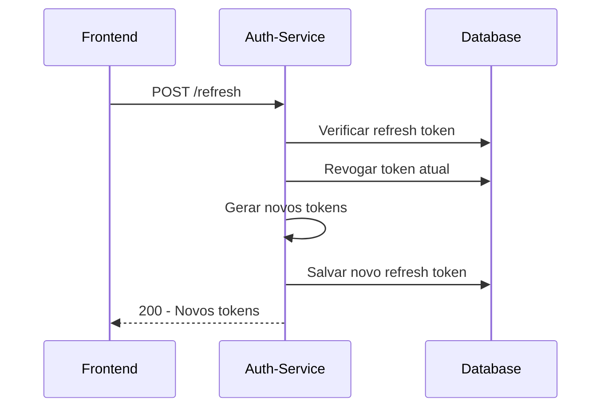
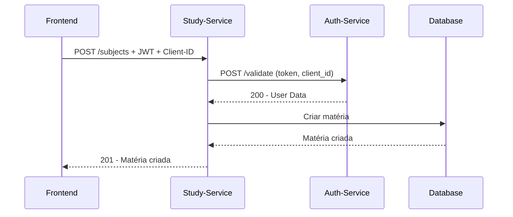

# 📚 Documentação Completa do Sistema Integrado

## 📋 Índice

1. [Visão Geral do Sistema](#visão-geral-do-sistema)
2. [Arquitetura Integrada](#arquitetura-integrada)
3. [Microserviços](#microserviços)
4. [Tecnologias Utilizadas](#tecnologias-utilizadas)
5. [Configuração e Instalação](#configuração-e-instalação)
6. [Estrutura do Banco de Dados](#estrutura-do-banco-de-dados)
7. [API Endpoints](#api-endpoints)
8. [Fluxos de Integração](#fluxos-de-integração)
9. [Segurança](#segurança)
10. [Deploy e Produção](#deploy-e-produção)
11. [Troubleshooting](#troubleshooting)
12. [Exemplos de Uso](#exemplos-de-uso)

---

## 🎯 Visão Geral do Sistema

### Propósito
O **Sistema Integrado de Gerenciamento de Estudos** é uma solução completa composta por dois microserviços especializados que trabalham em conjunto para fornecer autenticação robusta e gerenciamento acadêmico. O sistema permite que estudantes organizem seus estudos, matérias, provas e conteúdos de forma segura e eficiente.

### Características Principais
- ✅ **Arquitetura de Microserviços** com separação de responsabilidades
- ✅ **Autenticação JWT** centralizada e segura
- ✅ **Gerenciamento Acadêmico** completo (estudantes, matérias, provas)
- ✅ **Integração Transparente** entre serviços
- ✅ **Segurança Robusta** com validação de tokens
- ✅ **CORS Configurado** para frontends (portas 4000 e 4200)
- ✅ **Rate Limiting** e proteção contra ataques
- ✅ **Auditoria Completa** de operações sensíveis
- ✅ **Deploy Simplificado** com Docker Compose
- ✅ **Monitoramento** com health checks

---

## 🏗️ Arquitetura Integrada

### Visão Geral da Arquitetura
O sistema é composto por dois microserviços especializados que trabalham em conjunto:

```
┌─────────────────────────────────────────────────────────────────┐
│                        FRONTEND (4200)                         │
└─────────────────────┬───────────────────────────────────────────┘
                      │
┌─────────────────────▼───────────────────────────────────────────┐
│                 API GATEWAY / LOAD BALANCER                    │
└─────────────────────┬───────────────────────────────────────────┘
                      │
        ┌─────────────┼─────────────┐
        │             │             │
┌───────▼──────┐ ┌───▼────────┐ ┌──▼─────────────┐
│ Auth-Service │ │ Study-Mgr  │ │ Outros Services│
│   (8081)     │ │  (8080)    │ │                │
└──────────────┘ └────────────┘ └────────────────┘
        │             │
        └─────────────┼─────────────┐
                      │             │
              ┌───────▼──────┐ ┌───▼────────┐
              │ Auth DB      │ │ Study DB   │
              │ (SQLite)     │ │ (SQLite)   │
              └──────────────┘ └────────────┘
```

### Padrão Arquitetural
Cada microserviço segue o padrão **Clean Architecture**:

```
┌─────────────────────────────────────────────────────────────┐
│                    CAMADA DE APRESENTAÇÃO                   │
│  ┌─────────────┐  ┌─────────────┐  ┌─────────────────────┐  │
│  │   Routes    │  │  Handlers   │  │     Middleware      │  │
│  │             │  │             │  │                     │  │
│  └─────────────┘  └─────────────┘  └─────────────────────┘  │
└─────────────────────────────────────────────────────────────┘
┌─────────────────────────────────────────────────────────────┐
│                    CAMADA DE NEGÓCIO                        │
│  ┌─────────────────────────────────────────────────────────┐ │
│  │                  Services                              │ │
│  │    (AuthService / StudyService)                        │ │
│  └─────────────────────────────────────────────────────────┘ │
└─────────────────────────────────────────────────────────────┘
┌─────────────────────────────────────────────────────────────┐
│                    CAMADA DE DADOS                          │
│  ┌─────────────┐  ┌─────────────┐  ┌─────────────────────┐  │
│  │  Database   │  │   Models    │  │      Config         │  │
│  │             │  │             │  │                     │  │
│  └─────────────┘  └─────────────┘  └─────────────────────┘  │
└─────────────────────────────────────────────────────────────┘
```

---

## 🔧 Microserviços

### 1. Auth-Service (Porta 8081)
**Responsabilidade**: Autenticação e autorização

```
auth-service/
├── 📁 config/              # Configurações
├── 📁 database/            # Acesso a dados
├── 📁 handlers/            # Controladores HTTP
├── 📁 middleware/          # Middleware de autenticação
├── 📁 models/              # Modelos de dados
├── 📁 routes/              # Definição de rotas
├── 📁 services/            # Lógica de negócio
└── 📄 main.go              # Ponto de entrada
```

**Funcionalidades**:
- ✅ Registro e login de usuários
- ✅ Gerenciamento de tokens JWT
- ✅ Criação e validação de clientes
- ✅ Refresh tokens
- ✅ Validação de tokens

### 2. Study-Manager-Service (Porta 8080)
**Responsabilidade**: Gerenciamento acadêmico

```
study-manager-service/
├── 📁 internal/
│   ├── 📁 clients/         # Cliente para auth-service
│   ├── 📁 config/          # Configurações
│   ├── 📁 database/        # Acesso a dados (GORM)
│   ├── 📁 handlers/        # Controladores HTTP
│   ├── 📁 middleware/      # Middlewares de segurança
│   ├── 📁 models/          # Modelos de domínio
│   ├── 📁 repositories/    # Camada de repositórios
│   ├── 📁 routes/          # Definição de rotas
│   └── 📁 services/        # Lógica de negócio
├── 📁 scripts/             # Scripts de teste
├── 📄 main.go              # Ponto de entrada
└── 📄 go.mod               # Dependências
```

**Funcionalidades**:
- ✅ Gerenciamento de estudantes
- ✅ Gerenciamento de matérias
- ✅ Gerenciamento de provas/trabalhos
- ✅ Gerenciamento de conteúdos de estudo
- ✅ Sistema de anexos
- ✅ Referências bibliográficas
- ✅ Integração com auth-service

---

## 🛠️ Tecnologias Utilizadas

### Backend (Ambos os Microserviços)
- **Go 1.23+** - Linguagem principal
- **Gin Framework** - Framework web HTTP
- **JWT (golang-jwt/jwt/v5)** - Autenticação baseada em tokens
- **bcrypt** - Hash seguro de senhas
- **UUID** - Identificadores únicos

### Banco de Dados
- **SQLite** - Banco padrão para desenvolvimento
- **MySQL** - Suporte para produção
- **GORM** - ORM para o Study-Manager-Service
- **modernc.org/sqlite** - Driver SQLite puro em Go
- **go-sql-driver/mysql** - Driver MySQL

### Infraestrutura
- **Docker** - Containerização
- **Docker Compose** - Orquestração de containers
- **CORS** - Cross-Origin Resource Sharing
- **godotenv** - Gerenciamento de variáveis de ambiente

### Desenvolvimento
- **Air** - Hot reload para desenvolvimento
- **Make** - Automação de tarefas
- **Bash** - Scripts de teste
- **Clean Architecture** - Padrão arquitetural

---

## ⚙️ Configuração e Instalação

### Pré-requisitos
- Go 1.23+ ou superior
- Docker e Docker Compose
- Git

### Instalação com Docker Compose (Recomendado)

#### 1. Clone os Repositórios
```bash
# Auth-Service
git clone <url-auth-service>
cd auth-service

# Study-Manager-Service
git clone <url-study-manager-service>
cd study-manager-service
```

#### 2. Configure as Variáveis de Ambiente
```bash
# Auth-Service
cp env.example .env
# Edite o arquivo .env

# Study-Manager-Service
cp env.example .env
# Edite o arquivo .env
```

#### 3. Execute com Docker Compose
```bash
# Na pasta do study-manager-service
docker-compose up -d
```

### Instalação Local

#### 1. Auth-Service
```bash
cd auth-service
go mod tidy
go run main.go
```

#### 2. Study-Manager-Service
```bash
cd study-manager-service
go mod tidy
go run main.go
```

### Usando Make (Facilita o Desenvolvimento)

#### 1. Configurar Ambiente
```bash
# Na pasta do study-manager-service
make setup
```

#### 2. Executar em Desenvolvimento
```bash
# Com hot reload
make dev

# Ou executar com Docker
make docker-compose-up
```

#### 3. Testar Integração
```bash
make test-integration
```

### Configuração de Variáveis

#### Auth-Service (.env)
```env
# Configurações do Servidor
PORT=8081
ENV=development

# Configurações do Banco de Dados
DB_TYPE=sqlite
DB_PATH=auth_service.db
DB_HOST=localhost
DB_PORT=3306
DB_USER=root
DB_PASSWORD=password
DB_NAME=auth_service
DB_SSL_MODE=disable

# Configurações JWT
JWT_SECRET=your-super-secret-jwt-key-change-in-production
JWT_EXPIRATION_HOURS=24
JWT_REFRESH_EXPIRATION_HOURS=168
```

#### Study-Manager-Service (.env)
```env
# Configurações do servidor
PORT=8080
GIN_MODE=debug

# Configurações do banco de dados
DB_PATH=study_manager.db

# Configurações do microserviço de autenticação
AUTH_SERVICE_URL=http://localhost:8081
CLIENT_ID=your_client_id
AUTH_TIMEOUT_SECONDS=30

# Configurações de segurança
RATE_LIMIT_REQUESTS=100
RATE_LIMIT_WINDOW_MINUTES=1
AUDIT_ENABLED=true
ALLOWED_ORIGINS=http://localhost:3000,http://localhost:4000,http://localhost:4200
MAX_REQUEST_SIZE_MB=10

# Configurações de upload
UPLOAD_PATH=./uploads
MAX_UPLOAD_SIZE_MB=10
ALLOWED_FILE_TYPES=.pdf,.doc,.docx,.txt,.jpg,.jpeg,.png,.gif
ALLOWED_MIME_TYPES=application/pdf,application/msword,...
```

---

## 🗄️ Estrutura do Banco de Dados

### Auth-Service Database

#### 1. Tabela `users`
Armazena informações dos usuários do sistema.

| Campo | Tipo | Descrição |
|-------|------|-----------|
| `id` | UUID | Identificador único do usuário |
| `email` | VARCHAR | Email único do usuário |
| `password` | VARCHAR | Hash da senha (bcrypt) |
| `name` | VARCHAR | Nome completo do usuário |
| `active` | BOOLEAN | Status ativo/inativo |
| `created_at` | DATETIME | Data de criação |
| `updated_at` | DATETIME | Data de última atualização |

#### 2. Tabela `clients`
Gerencia aplicações clientes que podem usar o sistema de autenticação.

| Campo | Tipo | Descrição |
|-------|------|-----------|
| `id` | UUID | Identificador único do cliente |
| `name` | VARCHAR | Nome da aplicação cliente |
| `description` | TEXT | Descrição do cliente |
| `secret` | VARCHAR | Chave secreta do cliente |
| `active` | BOOLEAN | Status ativo/inativo |
| `created_at` | DATETIME | Data de criação |
| `updated_at` | DATETIME | Data de última atualização |

#### 3. Tabela `refresh_tokens`
Armazena tokens de renovação para gerenciar sessões.

| Campo | Tipo | Descrição |
|-------|------|-----------|
| `id` | UUID | Identificador único do token |
| `user_id` | UUID | ID do usuário (FK) |
| `client_id` | UUID | ID do cliente (FK) |
| `token` | VARCHAR | Token de renovação |
| `expires_at` | DATETIME | Data de expiração |
| `revoked` | BOOLEAN | Status revogado/ativo |
| `created_at` | DATETIME | Data de criação |
| `updated_at` | DATETIME | Data de última atualização |

### Study-Manager-Service Database

#### 1. Tabela `students`
Armazena informações dos estudantes.

| Campo | Tipo | Descrição |
|-------|------|-----------|
| `id` | UUID | Identificador único do estudante |
| `name` | VARCHAR | Nome do estudante |
| `email` | VARCHAR | Email único do estudante |
| `user_id` | VARCHAR | ID do usuário no auth-service |
| `created_at` | DATETIME | Data de criação |
| `updated_at` | DATETIME | Data de última atualização |
| `deleted_at` | DATETIME | Soft delete |

#### 2. Tabela `subjects`
Armazena matérias dos estudantes.

| Campo | Tipo | Descrição |
|-------|------|-----------|
| `id` | UUID | Identificador único da matéria |
| `student_id` | UUID | ID do estudante (FK) |
| `name` | VARCHAR | Nome da matéria |
| `description` | TEXT | Descrição da matéria |
| `created_at` | DATETIME | Data de criação |
| `updated_at` | DATETIME | Data de última atualização |
| `deleted_at` | DATETIME | Soft delete |

#### 3. Tabela `exams`
Armazena provas e trabalhos.

| Campo | Tipo | Descrição |
|-------|------|-----------|
| `id` | UUID | Identificador único da prova/trabalho |
| `subject_id` | UUID | ID da matéria (FK) |
| `title` | VARCHAR | Título da prova/trabalho |
| `description` | TEXT | Descrição |
| `due_date` | DATETIME | Data de entrega |
| `type` | VARCHAR | Tipo (exam, assignment, project, quiz) |
| `status` | VARCHAR | Status (pending, in_progress, completed) |
| `created_at` | DATETIME | Data de criação |
| `updated_at` | DATETIME | Data de última atualização |
| `deleted_at` | DATETIME | Soft delete |

#### 4. Tabela `study_contents`
Armazena conteúdos de estudo.

| Campo | Tipo | Descrição |
|-------|------|-----------|
| `id` | UUID | Identificador único do conteúdo |
| `subject_id` | UUID | ID da matéria (FK) |
| `exam_id` | UUID | ID da prova/trabalho (FK, opcional) |
| `title` | VARCHAR | Título do conteúdo |
| `description` | TEXT | Descrição |
| `is_completed` | BOOLEAN | Status de conclusão |
| `order` | INTEGER | Ordem do conteúdo |
| `created_at` | DATETIME | Data de criação |
| `updated_at` | DATETIME | Data de última atualização |
| `deleted_at` | DATETIME | Soft delete |

#### 5. Tabela `attachments`
Armazena anexos de provas/trabalhos.

| Campo | Tipo | Descrição |
|-------|------|-----------|
| `id` | UUID | Identificador único do anexo |
| `exam_id` | UUID | ID da prova/trabalho (FK) |
| `file_name` | VARCHAR | Nome do arquivo |
| `original_name` | VARCHAR | Nome original |
| `file_path` | VARCHAR | Caminho do arquivo |
| `file_size` | BIGINT | Tamanho do arquivo |
| `mime_type` | VARCHAR | Tipo MIME |
| `description` | TEXT | Descrição do anexo |
| `created_at` | DATETIME | Data de criação |
| `updated_at` | DATETIME | Data de última atualização |
| `deleted_at` | DATETIME | Soft delete |

#### 6. Tabela `exam_references`
Armazena referências bibliográficas.

| Campo | Tipo | Descrição |
|-------|------|-----------|
| `id` | UUID | Identificador único da referência |
| `exam_id` | UUID | ID da prova/trabalho (FK) |
| `title` | VARCHAR | Título da referência |
| `author` | VARCHAR | Autor |
| `publisher` | VARCHAR | Editora |
| `year` | INTEGER | Ano de publicação |
| `isbn` | VARCHAR | ISBN |
| `url` | VARCHAR | URL da referência |
| `description` | TEXT | Descrição |
| `type` | VARCHAR | Tipo (book, article, website, video, other) |
| `created_at` | DATETIME | Data de criação |
| `updated_at` | DATETIME | Data de última atualização |
| `deleted_at` | DATETIME | Soft delete |

### Índices e Relacionamentos

#### Auth-Service
- `idx_users_email` - Índice único no email
- `idx_refresh_tokens_user_id` - Índice no user_id
- `idx_refresh_tokens_token` - Índice no token

#### Study-Manager-Service
- `idx_students_user_id` - Índice no user_id
- `idx_subjects_student_id` - Índice no student_id
- `idx_exams_subject_id` - Índice no subject_id
- `idx_study_contents_subject_id` - Índice no subject_id
- `idx_attachments_exam_id` - Índice no exam_id
- `idx_exam_references_exam_id` - Índice no exam_id

#### Relacionamentos
- `users` ←→ `refresh_tokens` (1:N)
- `clients` ←→ `refresh_tokens` (1:N)
- `students` ←→ `subjects` (1:N)
- `subjects` ←→ `exams` (1:N)
- `exams` ←→ `study_contents` (1:N)
- `exams` ←→ `attachments` (1:N)
- `exams` ←→ `exam_references` (1:N)

---

## 🔌 API Endpoints

### Auth-Service (Porta 8081)
```
http://localhost:8081/api/v1
```

### Study-Manager-Service (Porta 8080)
```
http://localhost:8080/api/v1
```

### Auth-Service Endpoints

#### Endpoints Públicos

##### 1. Health Check
```http
GET /health
```
**Resposta:**
```json
{
  "status": "ok",
  "message": "Auth service is running"
}
```

#### 2. Registrar Usuário
```http
POST /register
```
**Request Body:**
```json
{
  "email": "usuario@exemplo.com",
  "password": "senha123456",
  "name": "Nome do Usuário"
}
```
**Resposta (201):**
```json
{
  "id": "uuid-do-usuario",
  "email": "usuario@exemplo.com",
  "name": "Nome do Usuário",
  "active": true,
  "created_at": "2024-01-01T00:00:00Z"
}
```

#### 3. Login
```http
POST /login
```
**Request Body:**
```json
{
  "email": "usuario@exemplo.com",
  "password": "senha123456",
  "client_id": "uuid-do-cliente"
}
```
**Resposta (200):**
```json
{
  "access_token": "jwt-token",
  "refresh_token": "refresh-token",
  "token_type": "Bearer",
  "expires_in": 86400
}
```

#### 4. Validar Token
```http
POST /validate
```
**Request Body:**
```json
{
  "token": "jwt-token",
  "client_id": "uuid-do-cliente"
}
```
**Resposta (200):**
```json
{
  "id": "uuid-do-usuario",
  "email": "usuario@exemplo.com",
  "name": "Nome do Usuário",
  "active": true,
  "created_at": "2024-01-01T00:00:00Z"
}
```

#### 5. Renovar Token
```http
POST /refresh
```
**Request Body:**
```json
{
  "refresh_token": "refresh-token",
  "client_id": "uuid-do-cliente"
}
```
**Resposta (200):**
```json
{
  "access_token": "novo-jwt-token",
  "refresh_token": "novo-refresh-token",
  "token_type": "Bearer",
  "expires_in": 86400
}
```

#### 6. Criar Cliente
```http
POST /clients
```
**Request Body:**
```json
{
  "name": "Nome do Cliente",
  "description": "Descrição do cliente"
}
```
**Resposta (201):**
```json
{
  "id": "uuid-do-cliente",
  "name": "Nome do Cliente",
  "description": "Descrição do cliente",
  "secret": "secret-gerado",
  "active": true,
  "created_at": "2024-01-01T00:00:00Z",
  "updated_at": "2024-01-01T00:00:00Z"
}
```

#### Endpoints Protegidos

##### 1. Obter Perfil
```http
GET /auth/profile
```
**Headers:**
```
Authorization: Bearer <jwt-token>
X-Client-ID: <client-id>
```
**Resposta (200):**
```json
{
  "id": "uuid-do-usuario",
  "email": "usuario@exemplo.com",
  "name": "Nome do Usuário",
  "active": true,
  "created_at": "2024-01-01T00:00:00Z"
}
```

### Study-Manager-Service Endpoints

#### Endpoints Públicos

##### 1. Health Check
```http
GET /health
```
**Resposta:**
```json
{
  "status": "ok",
  "message": "Study Manager Service is running",
  "service": "study-manager-service"
}
```

##### 2. Criar Estudante
```http
POST /students
```
**Headers:**
```
X-User-ID: <user-id-do-auth-service>
```
**Request Body:**
```json
{
  "name": "Nome do Estudante",
  "email": "estudante@exemplo.com"
}
```
**Resposta (201):**
```json
{
  "id": "uuid-do-estudante",
  "name": "Nome do Estudante",
  "email": "estudante@exemplo.com",
  "user_id": "user-id-do-auth-service",
  "created_at": "2024-01-01T00:00:00Z",
  "updated_at": "2024-01-01T00:00:00Z"
}
```

#### Endpoints Protegidos

**Headers obrigatórios para todas as rotas protegidas:**
```
Authorization: Bearer <jwt-token>
X-Client-ID: <client-id>
```

##### 1. Gerenciamento de Estudantes
```http
GET /students                    # Listar estudantes
GET /students/:id               # Buscar por ID
GET /students/user/:user_id     # Buscar por User ID
PUT /students/:id               # Atualizar estudante
DELETE /students/:id            # Remover estudante
```

##### 2. Gerenciamento de Matérias
```http
POST /subjects                  # Criar matéria
GET /subjects                   # Listar matérias do usuário
GET /subjects/:id               # Buscar matéria por ID
GET /subjects/:id/exams         # Buscar matéria com provas/trabalhos
PUT /subjects/:id               # Atualizar matéria
DELETE /subjects/:id            # Remover matéria
```

##### 3. Gerenciamento de Provas/Trabalhos
```http
POST /exams                     # Criar prova/trabalho
GET /exams                      # Listar provas/trabalhos do usuário
GET /exams/:id                  # Buscar prova/trabalho por ID
GET /exams/:id/details          # Buscar com detalhes completos
PUT /exams/:id                  # Atualizar prova/trabalho
DELETE /exams/:id               # Remover prova/trabalho
GET /subjects/:subject_id/exams # Listar provas/trabalhos de uma matéria
```

##### 4. Gerenciamento de Conteúdos de Estudo
```http
POST /study-contents            # Criar conteúdo de estudo
GET /study-contents/:id         # Buscar conteúdo por ID
PUT /study-contents/:id         # Atualizar conteúdo
DELETE /study-contents/:id      # Remover conteúdo
PUT /study-contents/:id/complete # Marcar como concluído
PUT /study-contents/reorder     # Reordenar conteúdos
GET /subjects/:subject_id/study-contents # Listar conteúdos de uma matéria
GET /exams/:exam_id/study-contents       # Listar conteúdos de uma prova/trabalho
```

##### 5. Gerenciamento de Anexos
```http
POST /exams/:exam_id/attachments        # Upload de anexo
GET /exams/:exam_id/attachments         # Listar anexos de uma prova/trabalho
GET /attachments/:id                    # Buscar anexo por ID
GET /attachments/:id/download           # Download de anexo
DELETE /attachments/:id                 # Remover anexo
```

##### 6. Gerenciamento de Referências Bibliográficas
```http
POST /exams/:exam_id/references         # Criar referência bibliográfica
GET /exams/:exam_id/references          # Listar referências de uma prova/trabalho
GET /references/:id                     # Buscar referência por ID
PUT /references/:id                     # Atualizar referência
DELETE /references/:id                  # Remover referência
```

---

## 🔄 Fluxos de Integração

### 1. Fluxo de Registro e Criação de Estudante


### 2. Fluxo de Login e Operações Autenticadas


### 3. Fluxo de Validação de Token


### 4. Fluxo de Renovação de Token


### 5. Fluxo de Criação de Matéria


---

## 🔐 Segurança

### Auth-Service

#### 1. Hash de Senhas
- **Algoritmo**: bcrypt
- **Custo**: Padrão (10 rounds)
- **Salt**: Automático e único por senha

#### 2. Tokens JWT
- **Algoritmo**: HMAC SHA-256
- **Claims**: user_id, email, client_id, type, exp, iat
- **Expiração**: Configurável (padrão 24h)
- **Refresh Token**: 7 dias (configurável)

#### 3. Validações de Segurança
- ✅ **Email único** por usuário
- ✅ **Senha mínima** de 8 caracteres
- ✅ **Cliente ativo** obrigatório
- ✅ **Usuário ativo** obrigatório
- ✅ **Validação de formato** de tokens
- ✅ **Verificação de expiração** automática

### Study-Manager-Service

#### 1. Integração com Auth-Service
- ✅ **Validação de Tokens** via auth-service
- ✅ **Client ID** obrigatório em todas as requisições
- ✅ **Usuário Ativo** verificado via auth-service
- ✅ **Propriedade de Dados** (usuários só acessam seus dados)

#### 2. Rate Limiting
- ✅ **Limite**: 100 requisições por minuto por IP
- ✅ **Headers**: X-RateLimit-* em todas as respostas
- ✅ **Limpeza Automática** de entradas expiradas

#### 3. Validação de Entrada
- ✅ **Headers Suspeitos** bloqueados automaticamente
- ✅ **User-Agents Maliciosos** detectados e bloqueados
- ✅ **Validação de UUID** rigorosa
- ✅ **Limite de Tamanho** de requisição (10MB)

#### 4. Auditoria
- ✅ **Operações Sensíveis** registradas (CREATE, UPDATE, DELETE)
- ✅ **Logs Estruturados** em JSON
- ✅ **Métricas de Performance** incluídas
- ✅ **Rastreamento de Usuário** (IP, User-Agent, contexto)

#### 5. Upload de Arquivos Seguro
- ✅ **Validação de Tipos** permitidos
- ✅ **Limitação de Tamanho** (10MB por arquivo)
- ✅ **Nomes Únicos** gerados automaticamente
- ✅ **Verificação de Propriedade** antes do download

### CORS (Ambos os Serviços)
- **Origens permitidas**: localhost:4000, localhost:4200
- **Métodos**: GET, POST, PUT, PATCH, DELETE, HEAD, OPTIONS
- **Headers**: Authorization, X-Client-ID, Content-Type
- **Credentials**: Habilitado

### Headers de Segurança
- **X-Client-ID**: Identificação do cliente
- **Authorization**: Bearer token
- **X-Content-Type-Options**: nosniff
- **X-Frame-Options**: DENY
- **X-XSS-Protection**: 1; mode=block

---

## 🚀 Deploy e Produção

### 1. Deploy com Docker Compose (Recomendado)

#### Configuração Completa
```yaml
version: '3.8'

services:
  study-manager-service:
    build:
      context: .
      dockerfile: Dockerfile
    container_name: study-manager-service
    environment:
      - PORT=8080
      - GIN_MODE=production
      - DB_PATH=/app/data/study_manager.db
      - AUTH_SERVICE_URL=http://auth-service:8081
      - CLIENT_ID=${CLIENT_ID}
      - RATE_LIMIT_REQUESTS=1000
      - AUDIT_ENABLED=true
      - ALLOWED_ORIGINS=https://yourdomain.com
    ports:
      - "8080:8080"
    volumes:
      - study_data:/app/data
      - study_uploads:/app/uploads
    depends_on:
      - auth-service
    restart: unless-stopped

  auth-service:
    build:
      context: ../auth-service
      dockerfile: Dockerfile
    container_name: auth-service
    environment:
      - PORT=8081
      - ENV=production
      - DB_TYPE=sqlite
      - DB_PATH=/app/data/auth_service.db
      - JWT_SECRET=${JWT_SECRET}
      - JWT_EXPIRATION_HOURS=24
      - JWT_REFRESH_EXPIRATION_HOURS=168
    ports:
      - "8081:8081"
    volumes:
      - auth_data:/app/data
    restart: unless-stopped

volumes:
  study_data:
  study_uploads:
  auth_data:
```

### 2. Configuração de Produção

#### Variáveis de Ambiente
```env
# Auth-Service
ENV=production
JWT_SECRET=chave-super-secreta-para-producao
DB_TYPE=mysql
DB_HOST=mysql
DB_USER=usuario-mysql
DB_PASSWORD=senha-mysql

# Study-Manager-Service
GIN_MODE=production
AUTH_SERVICE_URL=https://auth-service.prod.com
CLIENT_ID=prod_client_id
RATE_LIMIT_REQUESTS=1000
AUDIT_ENABLED=true
ALLOWED_ORIGINS=https://yourdomain.com
```

### 3. Monitoramento

#### Health Checks
```bash
# Auth-Service
curl https://auth-service.prod.com/api/v1/health

# Study-Manager-Service
curl https://study-service.prod.com/api/v1/health
```

#### Logs
- **Estruturados** em JSON
- **Timestamps** em UTC
- **Níveis**: INFO, ERROR, FATAL
- **Contexto** das operações

#### Métricas Recomendadas
- **Throughput**: Requests por segundo
- **Latência**: Tempo de resposta por endpoint
- **Taxa de erro**: Percentual de requests com erro
- **Uso de recursos**: CPU, memória, conexões de banco

### 4. Escalabilidade
- **Stateless**: Sem estado no servidor
- **Load Balancer**: Suporte a múltiplas instâncias
- **Database**: Suporte a replicação MySQL
- **Microserviços**: Escalabilidade independente

---

## 🔧 Troubleshooting

### Problemas Comuns

#### 1. Auth-Service Indisponível
```
Erro ao verificar saúde do auth-service: dial tcp: connection refused
```
**Solução**: 
- Verificar se o auth-service está rodando na porta 8081
- Verificar conectividade: `curl http://localhost:8081/api/v1/health`
- Verificar logs: `docker-compose logs auth-service`

#### 2. Token Inválido
```
token inválido: token is expired
```
**Solução**: 
- Renovar o token usando o endpoint `/refresh`
- Verificar JWT_SECRET no auth-service
- Verificar se o token não foi revogado

#### 3. Client ID Inválido
```
client_id não fornecido
```
**Solução**: 
- Criar um cliente usando o endpoint `/clients` no auth-service
- Usar o ID retornado nas requisições
- Verificar se o cliente está ativo

#### 4. Erro de CORS
```
Access to fetch at 'http://localhost:8080' from origin 'http://localhost:4200' has been blocked by CORS policy
```
**Solução**: 
- Verificar se a porta 4200 está nas origens permitidas
- Verificar configuração ALLOWED_ORIGINS
- Verificar headers da requisição

#### 5. Rate Limiting
```
limite de requisições excedido
```
**Solução**: 
- Aguardar reset do limite (1 minuto)
- Verificar configuração RATE_LIMIT_REQUESTS
- Implementar retry com backoff

#### 6. Propriedade de Dados
```
acesso negado: estudante não pertence ao usuário
```
**Solução**: 
- Verificar se o user_id está correto
- Verificar se o estudante foi criado com o user_id correto
- Verificar se o token pertence ao usuário correto

### Logs de Debug

#### Auth-Service
```bash
# Habilitar logs detalhados
export GIN_MODE=debug
go run main.go
```

#### Study-Manager-Service
```bash
# Habilitar logs detalhados
export GIN_MODE=debug
go run main.go
```

### Teste de Conectividade

#### Teste Individual
```bash
# Auth-Service
curl http://localhost:8081/api/v1/health

# Study-Manager-Service
curl http://localhost:8080/api/v1/health
```

#### Teste de Integração
```bash
# Executar script de teste completo
make test-integration

# Ou executar manualmente
./scripts/test_integration.sh
```

#### Teste de Validação de Token
```bash
# Validar token com auth-service
curl -X POST http://localhost:8081/api/v1/validate \
  -H "Content-Type: application/json" \
  -d '{"token": "SEU_JWT_TOKEN", "client_id": "SEU_CLIENT_ID"}'
```

### Monitoramento

#### Verificar Status dos Serviços
```bash
# Docker Compose
docker-compose ps

# Logs em tempo real
docker-compose logs -f

# Logs específicos
docker-compose logs -f auth-service
docker-compose logs -f study-manager-service
```

#### Verificar Conectividade Entre Serviços
```bash
# Do study-manager-service para auth-service
curl http://auth-service:8081/api/v1/health

# Verificar variáveis de ambiente
docker-compose exec study-manager-service env | grep AUTH
```

---

## 💡 Exemplos de Uso

### 1. Integração Completa com Frontend (JavaScript)

```javascript
class StudyManagerApp {
  constructor() {
    this.authBaseURL = 'http://localhost:8081/api/v1';
    this.studyBaseURL = 'http://localhost:8080/api/v1';
    this.clientId = null;
    this.accessToken = null;
  }

  // === AUTHENTICATION ===
  async createClient() {
    const response = await fetch(`${this.authBaseURL}/clients`, {
      method: 'POST',
      headers: { 'Content-Type': 'application/json' },
      body: JSON.stringify({
        name: 'Study Manager App',
        description: 'Aplicação de gerenciamento de estudos'
      })
    });
    const client = await response.json();
    this.clientId = client.id;
    return client;
  }

  async register(email, password, name) {
    const response = await fetch(`${this.authBaseURL}/register`, {
      method: 'POST',
      headers: { 'Content-Type': 'application/json' },
      body: JSON.stringify({ email, password, name })
    });
    return await response.json();
  }

  async login(email, password) {
    const response = await fetch(`${this.authBaseURL}/login`, {
      method: 'POST',
      headers: { 'Content-Type': 'application/json' },
      body: JSON.stringify({ 
        email, 
        password, 
        client_id: this.clientId 
      })
    });
    const tokens = await response.json();
    this.accessToken = tokens.access_token;
    localStorage.setItem('access_token', tokens.access_token);
    localStorage.setItem('refresh_token', tokens.refresh_token);
    return tokens;
  }

  // === STUDY MANAGEMENT ===
  async createStudent(name, email) {
    const response = await fetch(`${this.studyBaseURL}/students`, {
      method: 'POST',
      headers: { 
        'Content-Type': 'application/json',
        'X-User-ID': email // Usar email como user_id
      },
      body: JSON.stringify({ name, email })
    });
    return await response.json();
  }

  async getStudents() {
    const response = await fetch(`${this.studyBaseURL}/students`, {
      headers: {
        'Authorization': `Bearer ${this.accessToken}`,
        'X-Client-ID': this.clientId
      }
    });
    return await response.json();
  }

  async createSubject(name, description) {
    const response = await fetch(`${this.studyBaseURL}/subjects`, {
      method: 'POST',
      headers: {
        'Content-Type': 'application/json',
        'Authorization': `Bearer ${this.accessToken}`,
        'X-Client-ID': this.clientId
      },
      body: JSON.stringify({ name, description })
    });
    return await response.json();
  }

  async getSubjects() {
    const response = await fetch(`${this.studyBaseURL}/subjects`, {
      headers: {
        'Authorization': `Bearer ${this.accessToken}`,
        'X-Client-ID': this.clientId
      }
    });
    return await response.json();
  }

  async createExam(subjectId, title, description, dueDate) {
    const response = await fetch(`${this.studyBaseURL}/exams`, {
      method: 'POST',
      headers: {
        'Content-Type': 'application/json',
        'Authorization': `Bearer ${this.accessToken}`,
        'X-Client-ID': this.clientId
      },
      body: JSON.stringify({ 
        subject_id: subjectId, 
        title, 
        description, 
        due_date: dueDate 
      })
    });
    return await response.json();
  }

  async getExams() {
    const response = await fetch(`${this.studyBaseURL}/exams`, {
      headers: {
        'Authorization': `Bearer ${this.accessToken}`,
        'X-Client-ID': this.clientId
      }
    });
    return await response.json();
  }
}

// === USO COMPLETO ===
async function initializeApp() {
  const app = new StudyManagerApp();
  
  try {
    // 1. Criar cliente
    await app.createClient();
    console.log('Cliente criado:', app.clientId);
    
    // 2. Registrar usuário
    await app.register('user@example.com', 'password123', 'User Name');
    console.log('Usuário registrado');
    
    // 3. Fazer login
    await app.login('user@example.com', 'password123');
    console.log('Login realizado');
    
    // 4. Criar estudante
    const student = await app.createStudent('User Name', 'user@example.com');
    console.log('Estudante criado:', student);
    
    // 5. Criar matéria
    const subject = await app.createSubject('Matemática', 'Matéria de matemática básica');
    console.log('Matéria criada:', subject);
    
    // 6. Criar prova
    const exam = await app.createExam(
      subject.id, 
      'Prova 1', 
      'Primeira prova de matemática',
      new Date('2024-02-01')
    );
    console.log('Prova criada:', exam);
    
    // 7. Listar dados
    const students = await app.getStudents();
    const subjects = await app.getSubjects();
    const exams = await app.getExams();
    
    console.log('Estudantes:', students);
    console.log('Matérias:', subjects);
    console.log('Provas:', exams);
    
  } catch (error) {
    console.error('Erro:', error);
  }
}

// Inicializar aplicação
initializeApp();
```

### 2. Integração com Backend (Go)

```go
package main

import (
    "bytes"
    "encoding/json"
    "fmt"
    "net/http"
)

type AuthClient struct {
    BaseURL  string
    ClientID string
}

func NewAuthClient(baseURL string) *AuthClient {
    return &AuthClient{BaseURL: baseURL}
}

func (a *AuthClient) CreateClient(name, description string) error {
    data := map[string]string{
        "name":        name,
        "description": description,
    }
    
    jsonData, _ := json.Marshal(data)
    resp, err := http.Post(a.BaseURL+"/clients", 
        "application/json", bytes.NewBuffer(jsonData))
    
    if err != nil {
        return err
    }
    defer resp.Body.Close()
    
    var client map[string]interface{}
    json.NewDecoder(resp.Body).Decode(&client)
    a.ClientID = client["id"].(string)
    
    return nil
}

func (a *AuthClient) Login(email, password string) (map[string]interface{}, error) {
    data := map[string]string{
        "email":     email,
        "password":  password,
        "client_id": a.ClientID,
    }
    
    jsonData, _ := json.Marshal(data)
    resp, err := http.Post(a.BaseURL+"/login", 
        "application/json", bytes.NewBuffer(jsonData))
    
    if err != nil {
        return nil, err
    }
    defer resp.Body.Close()
    
    var tokens map[string]interface{}
    json.NewDecoder(resp.Body).Decode(&tokens)
    
    return tokens, nil
}
```

### 3. Teste Completo com cURL

```bash
#!/bin/bash

AUTH_BASE_URL="http://localhost:8081/api/v1"
STUDY_BASE_URL="http://localhost:8080/api/v1"

echo "🧪 Testando Sistema Integrado"
echo "=============================="

# 1. Criar cliente no auth-service
echo "1. Criando cliente..."
CLIENT_RESPONSE=$(curl -s -X POST "$AUTH_BASE_URL/clients" \
  -H "Content-Type: application/json" \
  -d '{"name": "Study Manager App", "description": "Aplicação de gerenciamento de estudos"}')
CLIENT_ID=$(echo $CLIENT_RESPONSE | jq -r '.id')
echo "Client ID: $CLIENT_ID"

# 2. Registrar usuário no auth-service
echo "2. Registrando usuário..."
curl -s -X POST "$AUTH_BASE_URL/register" \
  -H "Content-Type: application/json" \
  -d '{"email": "estudante@exemplo.com", "password": "senha123456", "name": "Estudante Teste"}'

# 3. Fazer login no auth-service
echo "3. Fazendo login..."
LOGIN_RESPONSE=$(curl -s -X POST "$AUTH_BASE_URL/login" \
  -H "Content-Type: application/json" \
  -d "{\"email\": \"estudante@exemplo.com\", \"password\": \"senha123456\", \"client_id\": \"$CLIENT_ID\"}")
ACCESS_TOKEN=$(echo $LOGIN_RESPONSE | jq -r '.access_token')
echo "Access Token obtido: ${ACCESS_TOKEN:0:50}..."

# 4. Criar estudante no study-manager-service
echo "4. Criando estudante..."
STUDENT_RESPONSE=$(curl -s -X POST "$STUDY_BASE_URL/students" \
  -H "Content-Type: application/json" \
  -H "X-User-ID: estudante@exemplo.com" \
  -d '{"name": "Estudante Teste", "email": "estudante@exemplo.com"}')
STUDENT_ID=$(echo $STUDENT_RESPONSE | jq -r '.id')
echo "Student ID: $STUDENT_ID"

# 5. Criar matéria (autenticado)
echo "5. Criando matéria..."
SUBJECT_RESPONSE=$(curl -s -X POST "$STUDY_BASE_URL/subjects" \
  -H "Content-Type: application/json" \
  -H "Authorization: Bearer $ACCESS_TOKEN" \
  -H "X-Client-ID: $CLIENT_ID" \
  -d '{"name": "Matemática", "description": "Matéria de matemática básica"}')
SUBJECT_ID=$(echo $SUBJECT_RESPONSE | jq -r '.id')
echo "Subject ID: $SUBJECT_ID"

# 6. Criar prova/trabalho (autenticado)
echo "6. Criando prova..."
EXAM_RESPONSE=$(curl -s -X POST "$STUDY_BASE_URL/exams" \
  -H "Content-Type: application/json" \
  -H "Authorization: Bearer $ACCESS_TOKEN" \
  -H "X-Client-ID: $CLIENT_ID" \
  -d "{\"subject_id\": \"$SUBJECT_ID\", \"title\": \"Prova 1\", \"description\": \"Primeira prova de matemática\", \"due_date\": \"2024-02-01T00:00:00Z\"}")
EXAM_ID=$(echo $EXAM_RESPONSE | jq -r '.id')
echo "Exam ID: $EXAM_ID"

# 7. Listar dados (autenticado)
echo "7. Listando dados..."
echo "Estudantes:"
curl -s -X GET "$STUDY_BASE_URL/students" \
  -H "Authorization: Bearer $ACCESS_TOKEN" \
  -H "X-Client-ID: $CLIENT_ID" | jq

echo "Matérias:"
curl -s -X GET "$STUDY_BASE_URL/subjects" \
  -H "Authorization: Bearer $ACCESS_TOKEN" \
  -H "X-Client-ID: $CLIENT_ID" | jq

echo "Provas:"
curl -s -X GET "$STUDY_BASE_URL/exams" \
  -H "Authorization: Bearer $ACCESS_TOKEN" \
  -H "X-Client-ID: $CLIENT_ID" | jq

echo "✅ Teste completo realizado com sucesso!"
```

---

## 📊 Métricas e Monitoramento

### Health Check
```bash
curl http://localhost:8081/api/v1/health
```

### Logs Estruturados
O sistema gera logs estruturados para facilitar o monitoramento:
- Timestamps em UTC
- Níveis de log (INFO, ERROR, FATAL)
- Contexto das operações
- IDs de requisição (quando implementado)

### Métricas Recomendadas
- **Throughput**: Requests por segundo
- **Latência**: Tempo de resposta por endpoint
- **Taxa de erro**: Percentual de requests com erro
- **Uso de recursos**: CPU, memória, conexões de banco

---

## 🔄 Versionamento da API

### Versão Atual: v1
- **Base Path**: `/api/v1`
- **Compatibilidade**: Backward compatible
- **Deprecação**: Notificada com 6 meses de antecedência

### Próximas Versões
- **v2**: Planejada para Q2 2024
- **Melhorias**: Rate limiting, audit logs, 2FA

---

## 📞 Suporte e Contribuição

### Reportar Bugs
1. Abra uma issue no repositório
2. Inclua logs e steps para reproduzir
3. Especifique versão e ambiente

### Contribuir
1. Fork o projeto
2. Crie uma branch para sua feature
3. Faça commit das mudanças
4. Abra um Pull Request

### Contato
- **Email**: suporte@exemplo.com
- **Documentação**: [Link para docs]
- **Issues**: [Link para issues]

---

## 📄 Licença

Este projeto está sob a licença MIT. Veja o arquivo [LICENSE](LICENSE) para mais detalhes.

---

## 🎉 Conclusão

O **Sistema Integrado de Gerenciamento de Estudos** representa uma solução completa e robusta para o gerenciamento acadêmico, combinando:

### ✅ **Microserviços Especializados**
- **Auth-Service**: Focado exclusivamente em autenticação e autorização
- **Study-Manager-Service**: Dedicado ao gerenciamento de dados acadêmicos

### ✅ **Integração Transparente**
- Comunicação HTTP entre serviços
- Validação de tokens em tempo real
- Separação clara de responsabilidades

### ✅ **Segurança Robusta**
- JWT tokens com validação centralizada
- Rate limiting e proteção contra ataques
- Auditoria completa de operações sensíveis
- Propriedade de dados garantida

### ✅ **Facilidade de Uso**
- Deploy simplificado com Docker Compose
- Scripts de teste automatizados
- Documentação completa e exemplos práticos
- Hot reload para desenvolvimento

### ✅ **Escalabilidade**
- Arquitetura stateless
- Suporte a múltiplas instâncias
- Banco de dados independentes
- Monitoramento integrado

### 🚀 **Próximos Passos**
1. **Implementar funcionalidades restantes** (anexos, referências)
2. **Adicionar sistema de notificações**
3. **Implementar cache Redis**
4. **Adicionar métricas Prometheus**
5. **Deploy em Kubernetes**

O sistema está pronto para uso em produção e pode ser facilmente estendido conforme necessário!

---

*Documentação do Sistema Integrado - Última atualização: $(date)*
