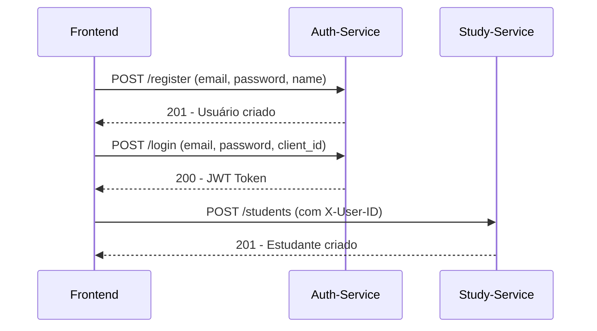
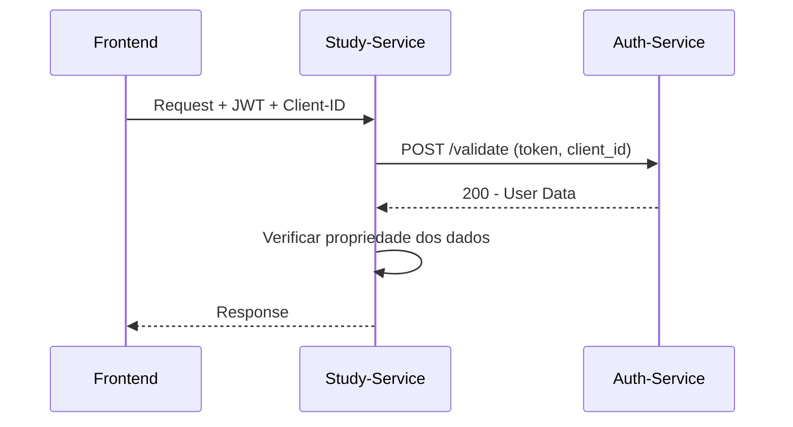

# 🔗 Integração Completa - Auth-Service + Study-Manager-Service

## Visão Geral

Este documento descreve como os dois microserviços trabalham em conjunto para fornecer um sistema completo de gerenciamento de estudos com autenticação robusta.

## Arquitetura Integrada

```
┌─────────────────────────────────────────────────────────────────┐
│                        FRONTEND (4200)                         │
└─────────────────────┬───────────────────────────────────────────┘
                      │
┌─────────────────────▼───────────────────────────────────────────┐
│                 API GATEWAY / LOAD BALANCER                    │
└─────────────────────┬───────────────────────────────────────────┘
                      │
        ┌─────────────┼─────────────┐
        │             │             │
┌───────▼──────┐ ┌───▼────────┐ ┌──▼─────────────┐
│ Auth-Service │ │ Study-Mgr  │ │ Outros Services│
│   (8081)     │ │  (8080)    │ │                │
└──────────────┘ └────────────┘ └────────────────┘
        │             │
        └─────────────┼─────────────┐
                      │             │
              ┌───────▼──────┐ ┌───▼────────┐
              │ Auth DB      │ │ Study DB   │
              │ (SQLite)     │ │ (SQLite)   │
              └──────────────┘ └────────────┘
```

## Fluxo de Integração

### 1. Registro e Autenticação


### 2. Operações Autenticadas


## Configuração dos Serviços

### Auth-Service (Porta 8081)
```env
PORT=8081
ENV=development
DB_TYPE=sqlite
DB_PATH=auth_service.db
JWT_SECRET=your-super-secret-jwt-key
JWT_EXPIRATION_HOURS=24
JWT_REFRESH_EXPIRATION_HOURS=168
```

### Study-Manager-Service (Porta 8080)
```env
PORT=8080
GIN_MODE=debug
DB_PATH=study_manager.db
AUTH_SERVICE_URL=http://localhost:8081
CLIENT_ID=your_client_id
AUTH_TIMEOUT_SECONDS=30
RATE_LIMIT_REQUESTS=100
RATE_LIMIT_WINDOW_MINUTES=1
AUDIT_ENABLED=true
ALLOWED_ORIGINS=http://localhost:3000,http://localhost:4000,http://localhost:4200
```

## Executando o Sistema

### Opção 1: Docker Compose (Recomendado)
```bash
# Na pasta do auth-service
docker-compose up -d

# Na pasta do study-manager-service
docker-compose up -d
```

### Opção 2: Desenvolvimento Local
```bash
# Terminal 1 - Auth-Service
cd auth-service
go run main.go

# Terminal 2 - Study-Manager-Service
cd study-manager-service
go run main.go
```

### Opção 3: Usando Make
```bash
# Configurar ambiente
make setup

# Executar em desenvolvimento
make dev

# Ou executar com Docker
make docker-compose-up
```

## Testando a Integração

### Script Automatizado
```bash
# Executar testes de integração
make test-integration

# Ou executar manualmente
chmod +x scripts/test_integration.sh
./scripts/test_integration.sh
```

### Teste Manual

1. **Criar Cliente no Auth-Service:**
```bash
curl -X POST http://localhost:8081/api/v1/clients \
  -H "Content-Type: application/json" \
  -d '{"name": "Study Manager App", "description": "Aplicação de estudos"}'
```

2. **Registrar Usuário:**
```bash
curl -X POST http://localhost:8081/api/v1/register \
  -H "Content-Type: application/json" \
  -d '{"email": "user@test.com", "password": "password123", "name": "User Test"}'
```

3. **Fazer Login:**
```bash
curl -X POST http://localhost:8081/api/v1/login \
  -H "Content-Type: application/json" \
  -d '{"email": "user@test.com", "password": "password123", "client_id": "CLIENT_ID_AQUI"}'
```

4. **Criar Estudante:**
```bash
curl -X POST http://localhost:8080/api/v1/students \
  -H "Content-Type: application/json" \
  -H "X-User-ID: user@test.com" \
  -d '{"name": "User Test", "email": "user@test.com"}'
```

5. **Operações Autenticadas:**
```bash
curl -X GET http://localhost:8080/api/v1/students \
  -H "Authorization: Bearer JWT_TOKEN_AQUI" \
  -H "X-Client-ID: CLIENT_ID_AQUI"
```

## Endpoints Principais

### Auth-Service (8081)
- `POST /api/v1/register` - Registrar usuário
- `POST /api/v1/login` - Fazer login
- `POST /api/v1/validate` - Validar token
- `POST /api/v1/refresh` - Renovar token
- `POST /api/v1/clients` - Criar cliente
- `GET /api/v1/health` - Health check

### Study-Manager-Service (8080)
- `POST /api/v1/students` - Criar estudante (público)
- `GET /api/v1/students` - Listar estudantes (autenticado)
- `POST /api/v1/subjects` - Criar matéria (autenticado)
- `GET /api/v1/subjects` - Listar matérias (autenticado)
- `POST /api/v1/exams` - Criar prova/trabalho (autenticado)
- `GET /api/v1/exams` - Listar provas/trabalhos (autenticado)
- `GET /api/v1/health` - Health check

## Segurança Implementada

### Auth-Service
- ✅ **JWT Tokens** com assinatura HMAC
- ✅ **Refresh Tokens** para renovação
- ✅ **Hash de Senhas** com bcrypt
- ✅ **Validação de Clientes** ativos
- ✅ **CORS** configurado para frontends

### Study-Manager-Service
- ✅ **Validação de Tokens** via auth-service
- ✅ **Rate Limiting** (100 req/min)
- ✅ **Validação de Headers** suspeitos
- ✅ **Auditoria** de operações sensíveis
- ✅ **Propriedade de Dados** (usuários só acessam seus dados)
- ✅ **CORS** seguro

## Monitoramento

### Health Checks
```bash
# Auth-Service
curl http://localhost:8081/api/v1/health

# Study-Manager-Service
curl http://localhost:8080/api/v1/health
```

### Logs
```bash
# Docker Compose
docker-compose logs -f

# Logs específicos
docker-compose logs -f auth-service
docker-compose logs -f study-manager-service
```

## Troubleshooting

### Problemas Comuns

1. **Auth-Service não responde**
   - Verificar se está rodando na porta 8081
   - Verificar logs: `docker-compose logs auth-service`

2. **Token inválido**
   - Verificar JWT_SECRET no auth-service
   - Verificar se o token não expirou
   - Verificar client_id correto

3. **CORS errors**
   - Verificar ALLOWED_ORIGINS no auth-service
   - Verificar headers da requisição

4. **Rate limiting**
   - Verificar RATE_LIMIT_REQUESTS
   - Aguardar reset do limite

### Debug
```bash
# Verificar conectividade entre serviços
curl http://localhost:8081/api/v1/health
curl http://localhost:8080/api/v1/health

# Verificar logs detalhados
GIN_MODE=debug go run main.go
```

## Próximos Passos

### Funcionalidades Futuras
1. **Sistema de Notificações** - Lembretes de provas
2. **Upload de Arquivos** - Anexos para provas
3. **Relatórios** - Progresso de estudos
4. **Compartilhamento** - Materiais entre estudantes
5. **Busca Avançada** - Filtros e pesquisa

### Melhorias Técnicas
1. **Cache Redis** - Performance
2. **Métricas Prometheus** - Monitoramento
3. **Tracing** - Distributed tracing
4. **Kubernetes** - Deploy em cluster
5. **CI/CD** - Pipeline automatizado

## Conclusão

O sistema integrado fornece:

- ✅ **Autenticação Robusta** via auth-service
- ✅ **Gerenciamento de Estudos** via study-manager-service
- ✅ **Segurança Completa** com validação de tokens
- ✅ **Escalabilidade** com microserviços independentes
- ✅ **Monitoramento** com health checks e logs
- ✅ **Facilidade de Deploy** com Docker

Os dois serviços trabalham em perfeita harmonia, com o auth-service gerenciando toda a autenticação e o study-manager-service focando exclusivamente no gerenciamento de dados acadêmicos, garantindo separação de responsabilidades e alta disponibilidade.
