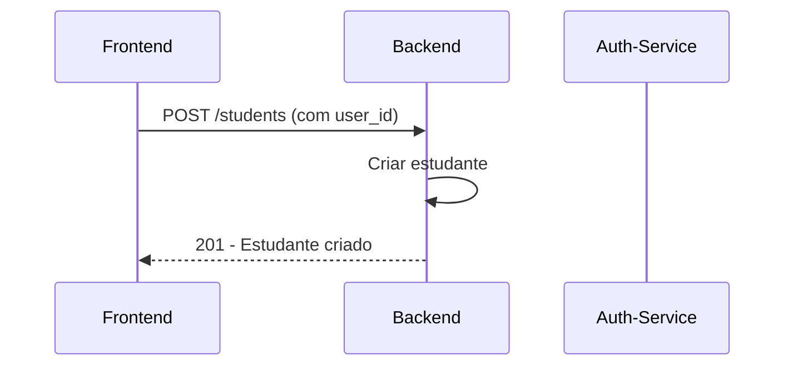
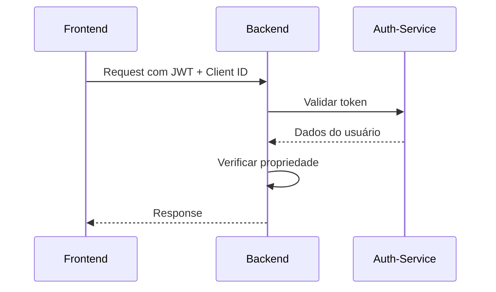

# Study Manager Service - Backend

## Visão Geral

O **Study Manager Service** é um microserviço backend desenvolvido em Go que gerencia planos de estudos para estudantes. Ele se integra com o microserviço de autenticação para fornecer uma API REST completa para gerenciamento de estudantes, matérias, provas/trabalhos, conteúdos de estudo, anexos e referências bibliográficas.

## Arquitetura

### Padrão Clean Architecture
```
internal/
├── clients/          # Clientes para serviços externos (auth-service)
├── config/           # Configurações do sistema
├── database/         # Camada de acesso a dados (GORM)
├── handlers/         # Camada de apresentação (HTTP)
├── middleware/       # Middlewares HTTP (auth, CORS, rate limiting)
├── models/          # Entidades de domínio e DTOs
├── repositories/    # Camada de acesso a dados
├── services/        # Lógica de negócio
└── routes/          # Configuração de rotas
```

### Integração com Auth-Service
- **Validação de Tokens**: Todas as rotas protegidas validam JWT com o auth-service
- **Client ID**: Verificação obrigatória de client_id em todas as requisições
- **Usuário Ativo**: Apenas usuários ativos podem acessar o sistema
- **Propriedade de Dados**: Estudantes só acessam seus próprios dados

## Tecnologias

- **Go 1.21+** - Linguagem principal
- **Gin Framework** - Framework web HTTP
- **GORM** - ORM para banco de dados
- **SQLite** - Banco de dados (desenvolvimento)
- **JWT** - Autenticação via auth-service
- **Docker** - Containerização

## Configuração

### Variáveis de Ambiente

```env
# Servidor
PORT=8080
GIN_MODE=debug

# Banco de Dados
DB_PATH=study_manager.db

# Auth Service
AUTH_SERVICE_URL=http://localhost:8081
CLIENT_ID=your_client_id
AUTH_TIMEOUT_SECONDS=30

# Segurança
RATE_LIMIT_REQUESTS=100
RATE_LIMIT_WINDOW_MINUTES=1
AUDIT_ENABLED=true
ALLOWED_ORIGINS=http://localhost:3000,http://localhost:4000,http://localhost:4200
MAX_REQUEST_SIZE_MB=10

# Upload
UPLOAD_PATH=./uploads
MAX_UPLOAD_SIZE_MB=10
ALLOWED_FILE_TYPES=.pdf,.doc,.docx,.txt,.jpg,.jpeg,.png,.gif
ALLOWED_MIME_TYPES=application/pdf,application/msword,...
```

## Instalação

### Desenvolvimento Local

1. **Clone e configure:**
```bash
git clone <repository-url>
cd study-manager-service
cp env.example .env
# Edite o arquivo .env
```

2. **Instale dependências:**
```bash
go mod tidy
```

3. **Execute:**
```bash
go run main.go
```

### Docker

```bash
# Build e execução
docker-compose up -d

# Apenas o backend
docker build -t study-manager-service .
docker run -p 8080:8080 --env-file .env study-manager-service
```

## API Endpoints

### Base URL
```
http://localhost:8080/api/v1
```

### Autenticação
Todas as rotas (exceto registro de estudante) requerem:
```
Authorization: Bearer <jwt-token>
X-Client-ID: <client_id>
```

### Endpoints Principais

#### Estudantes
- `POST /students` - Criar estudante (público)
- `GET /students` - Listar estudantes
- `GET /students/:id` - Buscar por ID
- `GET /students/user/:user_id` - Buscar por User ID
- `PUT /students/:id` - Atualizar
- `DELETE /students/:id` - Remover

#### Matérias
- `POST /subjects` - Criar matéria
- `GET /subjects` - Listar matérias do usuário
- `GET /subjects/:id` - Buscar por ID
- `GET /subjects/:id/exams` - Buscar com provas/trabalhos
- `PUT /subjects/:id` - Atualizar
- `DELETE /subjects/:id` - Remover

#### Provas/Trabalhos
- `POST /exams` - Criar prova/trabalho
- `GET /exams` - Listar do usuário
- `GET /exams/:id` - Buscar por ID
- `GET /exams/:id/details` - Buscar com detalhes
- `PUT /exams/:id` - Atualizar
- `DELETE /exams/:id` - Remover
- `GET /subjects/:subject_id/exams` - Listar por matéria

## Segurança

### Middlewares Implementados
1. **CORS** - Cross-Origin Resource Sharing
2. **Rate Limiting** - Limitação de requisições
3. **Validação de Entrada** - Headers e dados suspeitos
4. **Auditoria** - Log de operações sensíveis
5. **Autenticação** - Validação JWT com auth-service

### Validações
- ✅ **Propriedade de Dados** - Usuários só acessam seus dados
- ✅ **Client ID** - Verificação obrigatória
- ✅ **Usuário Ativo** - Apenas usuários ativos
- ✅ **Rate Limiting** - 100 req/min por IP
- ✅ **Validação de Entrada** - Headers e dados suspeitos

## Fluxo de Integração

### 1. Registro de Estudante


### 2. Operações Autenticadas


## Monitoramento

### Health Check
```bash
curl http://localhost:8080/api/v1/health
```

### Logs
- **Estruturados** em JSON
- **Auditoria** de operações sensíveis
- **Segurança** com tentativas de acesso
- **Performance** com métricas de tempo

## Desenvolvimento

### Estrutura de Commits
```
feat: nova funcionalidade
fix: correção de bug
docs: documentação
style: formatação
refactor: refatoração
test: testes
chore: manutenção
```

### Testes
```bash
# Executar testes
go test ./...

# Com cobertura
go test -cover ./...
```

## Deploy

### Produção
1. Configure variáveis de ambiente
2. Build da aplicação
3. Deploy com Docker
4. Configure load balancer
5. Monitore logs e métricas

### Variáveis de Produção
```env
GIN_MODE=production
AUTH_SERVICE_URL=https://auth-service.prod.com
CLIENT_ID=prod_client_id
RATE_LIMIT_REQUESTS=1000
AUDIT_ENABLED=true
```

## Troubleshooting

### Problemas Comuns

1. **Auth-service indisponível**
   - Verificar conectividade
   - Verificar configuração AUTH_SERVICE_URL

2. **Token inválido**
   - Verificar JWT_SECRET no auth-service
   - Verificar expiração do token

3. **Client ID inválido**
   - Criar cliente no auth-service
   - Verificar configuração CLIENT_ID

4. **CORS errors**
   - Verificar ALLOWED_ORIGINS
   - Verificar headers da requisição

## Contribuição

1. Fork o projeto
2. Crie uma branch (`git checkout -b feature/nova-funcionalidade`)
3. Commit suas mudanças (`git commit -m 'feat: adiciona nova funcionalidade'`)
4. Push para a branch (`git push origin feature/nova-funcionalidade`)
5. Abra um Pull Request

## Licença

Este projeto está sob a licença MIT. Veja o arquivo [LICENSE](LICENSE) para mais detalhes.
